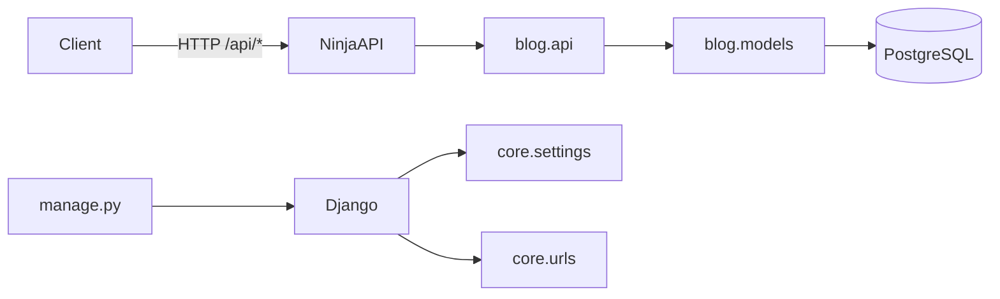

# Chat transcript — `e91d1ecb-910f-4ad8-9b6a-c4d2dc0b0732`

**Project:** fintual-backend-infra-test  
**Topic:** Performance (list endpoints, post detail, user endpoints)  
**Plans:** `posts_list_performance_f1e0574d.plan.md`, `finish_performance_slice_a686e3e3.plan.md`  
**Commit:** `a1ed835` — perf: optimize list, post detail, and user endpoints

---

## 1 — User

Explain this codebase. Point me to the main entry points, key modules, and anything I should read before making changes. 

@README.md start with this

---

## 2 — Assistant

## What this repo is

Per [README.md](README.md), this is a **Fintual Backend/DevOps interview take-home**: a small **content API** (users, posts, comments, tags) built with **Django 5.2**, **django-ninja**, and **PostgreSQL 16**. The brief asks you to improve **developer experience**, **performance** (especially after seeding ~100k posts / ~500k comments), and **production readiness**, then document choices in `NOTES.md`. Auth and broad test coverage are explicitly out of scope.

You also have untracked local tooling (`Makefile`, `docker-compose.yml`, `setup.ps1`, `NEW_README.md`) that extends the upstream README flow; the canonical assignment text is still **README.md**.

---

## Architecture at a glance



- **One Django app**: `blog` (domain + API + seed command + smoke tests).
- **Project package**: `core` (settings, URL wiring, WSGI/ASGI).
- **No auth**, **no pagination**, **minimal admin** — by design.

---

## Main entry points

| Entry | Role |
|--------|------|
| [`manage.py`](manage.py) | CLI: `migrate`, `seed`, `runserver`, etc. Sets `DJANGO_SETTINGS_MODULE=core.settings`. |
| [`core/urls.py`](core/urls.py) | Mounts Ninja at `/api/` and Django admin at `/admin/`. |
| [`blog/api.py`](blog/api.py) | **All HTTP API handlers** (the heart of the service). |
| [`core/settings.py`](core/settings.py) | DB, `DEBUG`, `INSTALLED_APPS`, env via `python-dotenv`. |
| [`core/wsgi.py`](core/wsgi.py) / [`core/asgi.py`](core/asgi.py) | Production server hooks (standard Django). |
| [`blog/management/commands/seed.py`](blog/management/commands/seed.py) | Bulk data generator for perf testing. |

**Docs UI**: after `runserver`, OpenAPI at `http://localhost:8000/api/docs` (Ninja default on the `NinjaAPI` instance in `core/urls.py`).

**Local run (upstream README)**:

```sh
mise install && uv sync
createdb backend_devops_interview   # or equivalent
uv run python manage.py migrate
uv run python manage.py seed        # slow; large dataset
uv run python manage.py runserver
```

---

## Key modules (read in this order)

1. **[`README.md`](README.md)** — API table, assignment scope, non-goals, deliverable.
2. **[`blog/models.py`](blog/models.py)** — `User`, `Tag`, `Post`, `Comment`; M2M tags; no indexes beyond Django defaults in [`blog/migrations/0001_initial.py`](blog/migrations/0001_initial.py).
3. **[`blog/api.py`](blog/api.py)** — Every endpoint and serialization logic (inline dict builders, not DRF serializers).
4. **[`blog/schemas.py`](blog/schemas.py)** — Ninja request/response schemas (types for OpenAPI).
5. **[`core/settings.py`](core/settings.py)** — Env-driven DB; note `django.contrib.postgres` is installed but **not used** in API code yet (room for full-text search, etc.).
6. **[`blog/management/commands/seed.py`](blog/management/commands/seed.py)** — Scale and data shape (power-law authors, tag skew, batches of 1000).
7. **[`blog/tests/test_posts.py`](blog/tests/test_posts.py)** + **[`blog/tests/test_comments.py`](blog/tests/test_comments.py)** + **[`conftest.py`](conftest.py)** — Smoke tests for CI; [`pyproject.toml`](pyproject.toml) configures pytest/ruff.
8. **[`.env.example`](.env.example)** — Config contract if you touch settings or DX.

**Supporting / optional for your work:**

- [`mise.toml`](mise.toml) — Python 3.14 + uv via mise.
- [`docker-compose.yml`](docker-compose.yml), [`Makefile`](Makefile), [`NEW_README.md`](NEW_README.md), [`setup.ps1`](setup.ps1) — If you use them, read these for **your** local/staging/prod workflow (not in upstream README).

---

## API surface (implemented in `blog/api.py`)

Matches the README table:

- **Posts**: list, search (`icontains` on title/body), by tag slug, detail (increments `view_count`), create, add comment.
- **Users**: by id (with `post_count` / `comment_count`), find by email.

Serialization is manual (`_serialize_*` helpers) rather than ORM → schema auto-mapping.

---

## What to know before changing code

### Assignment intent

The README steers you toward **depth over breadth**: pick 2–3 areas (DX, perf, prod) and explain tradeoffs in `NOTES.md`. Reshaping the domain is discouraged unless needed for perf.

### Likely performance hotspots (good first read of `blog/api.py`)

After `seed`, these patterns will hurt at scale:

- **`GET /api/posts`** — loads all published posts, no pagination; per-post `post.tags.all()` → **N+1**.
- **`GET /api/posts/search`** — `icontains` without indexes / full-text.
- **`GET /api/posts/{id}`** — loads all comments for a post; `view_count` **write on every read**; tags N+1 again.
- **`GET /api/users/{id}`** — `user.posts.count()` and `user.comments.count()` (extra queries per request).

Any perf work should be validated **against seeded data**, not empty DB.

### Tests

- Run: `uv run pytest` (see Makefile `make test` if you use it).
- Tests use Django `Client` against `/api/...`; they are **smoke-level**, not exhaustive.

### Tooling

- **Deps**: `uv` + [`pyproject.toml`](pyproject.toml) (Python ≥3.14, Django 5.2, django-ninja, psycopg3, faker, dotenv).
- **Lint/format**: ruff (`E`, `F`, `I`, `UP`, `B`).

### Things that are intentionally thin

- [`blog/admin.py`](blog/admin.py) — empty registration.
- No middleware beyond Django defaults; no CORS, health checks, or static prod config in repo.
- Custom `User` model is **not** Django’s `AUTH_USER_MODEL`; it’s a plain `blog.models.User`.

---

## Suggested reading checklist before your first PR-sized change

1. README assignment + API table.  
2. `blog/models.py` + migration (schema as deployed).  
3. `blog/api.py` end-to-end (this is where most behavior lives).  
4. `seed.py` (understand data volume and distributions).  
5. Hit `/api/docs` locally after seed; profile slow endpoints.  
6. Skim tests so CI changes stay green.  
7. If improving DX: `.env.example`, `docker-compose.yml`, Makefile/`setup.ps1`, and whether you align with or replace `NEW_README.md`.

If you want, I can go deeper on a specific area (e.g. query-by-query perf analysis of `blog/api.py`, or how the seed command shapes load) — still in Ask mode, so guidance only unless you switch to Agent mode for implementation.

---

## 3 — User

Ok this i made some changes, i'm creating a the new readme @NEW_README.md that will be the new and improved one so you can see the difference and tell me how i'm going, also you can check commits to see the difference. So this chat will be related to the Performance side, so lets work on it.

I create a temporal file @blog-tables-schema.sql with the current schema sql of the main blog tables.

Testing the first endpoint of get posts this is very slow so lets fix it and related ones, first thing that i noticed is that we are filter by is_published=true and we don't have a index for that, same for search a post by icontains for the tittle or body, also like you said we don't have pagination, lets plan a good idea to improve performance lets find why and how fix it, lets create migration file if required to implement indexes

---

## 4 — Assistant

Confirming root causes: ~90k published rows returned at once, N+1 on authors/tags, and no DB indexes for the list/sort pattern. `icontains` won't benefit from btree indexes—PostgreSQL trigram or full-text search is needed.

---

## 5 — User

Performance plan: post list endpoints

Implement the plan as specified, it is attached for your reference. Do NOT edit the plan file itself.

To-do's from the plan have already been created. Do not create them again. Mark them as in_progress as you work, starting with the first one. Don't stop until you have completed all the to-dos.

---

## 6 — Assistant

Implementing the performance plan: starting with the queryset helper and working through migrations, API changes, and tests.

Performance work for post list endpoints is implemented. Summary:

## Changes

### Query layer
- [`blog/queries.py`](blog/queries.py) — `published_posts_qs()` with `select_related`, `prefetch_related`, `defer("body")`, `order_by("-created_at")`
- [`blog/serializers.py`](blog/serializers.py) — shared serialization for list + detail
- [`blog/pagination.py`](blog/pagination.py) — `PostPageNumberPagination` (page size 20, max 100) serializes only the current page

### API ([`blog/api.py`](blog/api.py))
- `GET /api/posts`, `/api/posts/search`, `/api/posts/by-tag/{slug}` use `@paginate(PostPageNumberPagination)`
- Search uses `TrigramSimilarity` (threshold `0.1`) instead of `icontains`

### Database
- [`blog/models.py`](blog/models.py) — `Post.Meta.indexes` (partial + GIN trigram)
- [`blog/migrations/0002_post_performance_indexes.py`](blog/migrations/0002_post_performance_indexes.py) — `TrigramExtension` + indexes

### Tests & docs
- Updated [`blog/tests/test_posts.py`](blog/tests/test_posts.py) for `{items, count}` + pagination + query-count test
- [`NEW_README.md`](NEW_README.md) — pagination section
- [`NOTES.md`](NOTES.md) — rationale, verification, deferrals

## API breaking change

List endpoints now return:

```json
{ "items": [...], "count": 90000 }
```

Use `?page=1&page_size=20` (max `page_size=100`).

## Apply on your machine

```bash
uv run python manage.py migrate
```

All **5 tests pass**. On a seeded DB, try `GET /api/posts?page=1&page_size=20` — it should be much faster than loading all ~90k posts.

---

## 7 — User

Implement the plan as specified, it is attached for your reference. Do NOT edit the plan file itself.

To-do's from the plan have already been created. Do not create them again. Mark them as in_progress as you work, starting with the first one. Don't stop until you have completed all the to-dos.

---

## 8 — User

Is there changes on @blog/migrations/0001_initial.py because on db migrations i only have the second one 0002 and we have some changes in this file

---

## 9 — Assistant

**Short answer:** The performance work did **not** add a new schema migration for `0001`. All DB changes for that plan are in **`0002_post_performance_indexes`**. What you see different in `0001_initial.py` is almost certainly **formatting only** (e.g. from `ruff format`), not new tables or columns.

## What the performance plan changed

| File | Role |
|------|------|
| [`blog/migrations/0001_initial.py`](blog/migrations/0001_initial.py) | Unchanged **semantically** — still creates `Tag`, `User`, `Post`, `Comment` |
| [`blog/migrations/0002_post_performance_indexes.py`](blog/migrations/0002_post_performance_indexes.py) | **New** — `pg_trgm` extension + partial index + GIN trigram indexes on `Post` |

`0002` depends on `0001`:

```9:11:blog/migrations/0002_post_performance_indexes.py
    dependencies = [
        ("blog", "0001_initial"),
    ]
```

So Django always treats `0001` as already applied before it runs `0002`.

## Why you might “only see” migration 0002

When you run `migrate` on a DB that was already set up with `make setup` / `migrate` + `seed`:

1. **`0001_initial` was applied earlier** — it’s already in `django_migrations`.
2. **`0002` is the only one that runs** — output looks like: `Applying blog.0002_post_performance_indexes... OK`.

That’s expected. Check with:

```sql
SELECT * FROM django_migrations WHERE app = 'blog' ORDER BY id;
```

You should see **both** `0001_initial` and `0002_post_performance_indexes` (unless this is a brand-new DB that never migrated, in which case both run in one go).

## Why `0001_initial.py` looks different in the editor

The current file is still the same migration logically (four `CreateModel` operations, same fields). Typical diffs vs the original clone are:

- **Line wrapping** — `BigAutoField(...)` split across multiple lines  
- **Quotes** — `'blog.tag'` → `"blog.tag"`  
- **No new `operations`** — still ends at the four models, no indexes in `0001`

That matches running **`ruff format`** on the repo during the perf work, not a new migration.

**Important:** Editing `0001_initial.py` after `0001` is already applied does **not** re-run it. Django only runs migrations that are **missing** from `django_migrations`. Format-only edits don’t affect the DB.

## When you should worry

You’d only have a problem if someone **changed operations inside `0001`** (added/removed fields) **after** `0001` was already applied on a shared DB. Then the DB and migration history could drift. From the current `0001` content, it’s still the original initial schema — indexes live only in `0002`.

## Summary

- **DB changes for perf:** only **`0002`** (indexes + `pg_trgm`).  
- **`0001` on disk:** likely reformatted, not a second migration to apply.  
- **Migrate output showing only `0002`:** normal if `0001` was applied when you first set up the project.

If you want to confirm on your machine, run the `django_migrations` query above or `python manage.py showmigrations blog` — you should see `[X]` on both `0001` and `0002`.

---

## 10 — User

Ok lets implements what is missing just to finish the performance side, do only required changes to finish this step of performance because we won't want mix with the other steps dev epxerience and production readiness because we will take it in other agent.

So make a simple plan to finish the performance and like you said in NOTES.md lets do only post detail and user endpoints and do not do cursor pagination and Authentication. Also add user.email index and related things, then create a commit message just with related changes of Performance because we will create another commit for developer experience (docker, envs, makefile and powershell file, etc)

---

## 11 — Assistant

Hot posts can accumulate thousands of comments (long-tail seeding). Comment pagination on post detail is necessary, not optional.

---

## 12 — User

Finish performance slice (post detail + users)

Implement the plan as specified, it is attached for your reference. Do NOT edit the plan file itself.

To-do's from the plan have already been created. Do not create them again. Mark them as in_progress as you work, starting with the first one. Don't stop until you have completed all the to-dos.

---

## 13 — Assistant

Performance slice is complete. Summary:

## Phase 2 changes

**Post detail** (`GET /api/posts/{id}`):
- `post_detail_qs()` — prefetch author/tags, annotate `comment_count`
- `view_count` via `F("view_count") + 1` (no full `save()`)
- Comment pagination: `comment_page` (default 1), `comment_page_size` (default 20, max 50)
- Response adds `comment_count`; `comments` is only the current page

**User endpoints**:
- `user_detail_qs()` — `post_count` / `comment_count` in one query
- `User.email` index — migration `0003_user_email_index`

**New/updated files:** [`blog/queries.py`](blog/queries.py), [`blog/schemas.py`](blog/schemas.py), [`blog/tests/test_users.py`](blog/tests/test_users.py), expanded [`blog/tests/test_posts.py`](blog/tests/test_posts.py), [`NOTES.md`](NOTES.md)

## Tests

All **9 tests** pass.

## Git commit (performance only)

Commit `a1ed835` — **perf: optimize list, post detail, and user endpoints**

**Included:** blog API, models, schemas, queries, pagination, serializers, migrations 0002/0003, tests, NOTES.md

**Left unstaged** (for DX commit): `Makefile`, `docker-compose.yml`, `setup.ps1`, `NEW_README.md`, `blog-tables-schema.sql`, ruff-only edits to `0001_initial.py`, etc.

## Apply locally

```bash
uv run python manage.py migrate
```

Example calls:
- `GET /api/posts/1?comment_page=1&comment_page_size=20`
- `GET /api/users/find?email=user00001@example.com`

---

## 14 — User

Implement the plan as specified, it is attached for your reference. Do NOT edit the plan file itself.

To-do's from the plan have already been created. Do not create them again. Mark them as in_progress as you work, starting with the first one. Don't stop until you have completed all the to-dos.

---

## 15 — User

Ok i create a folder named transcript where i want to put all this chat history there in a md format, call the file the name of this session

---

## 16 — Assistant

Created the transcript for this Cursor session:

**File:** [`transcript/e91d1ecb-910f-4ad8-9b6a-c4d2dc0b0732.md`](e91d1ecb-910f-4ad8-9b6a-c4d2dc0b0732.md)

Same naming pattern as your other exports (`62bc915d-...`, `a697a60e-...`): UUID from the agent session folder under `.cursor/projects/.../agent-transcripts/`.

The markdown includes numbered user/assistant turns, plan references, commit `a1ed835`, a files-touched summary, and omits tool-call noise for readability.

---

## Files touched in this session (summary)

| Area | Files |
| ---- | ----- |
| API | blog/api.py |
| Queries | blog/queries.py |
| Models | blog/models.py |
| Schemas | blog/schemas.py |
| Serializers | blog/serializers.py |
| Pagination | blog/pagination.py |
| Migrations | 0002_post_performance_indexes, 0003_user_email_index |
| Tests | blog/tests/test_posts.py, blog/tests/test_users.py |
| Docs | NOTES.md, NEW_README.md (pagination section) |

---

*Exported from Cursor agent session. Tool calls and intermediate steps omitted for readability.*
